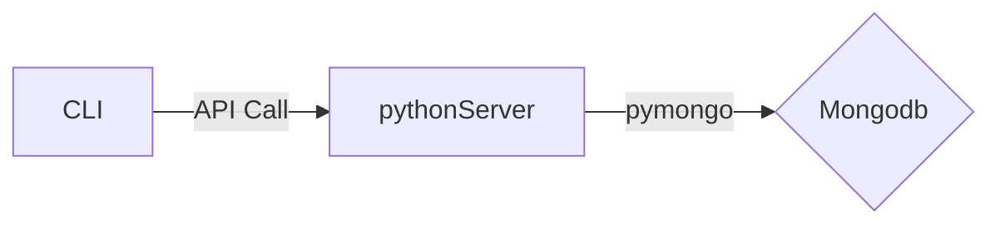

# python-server Project

Create events and then store those events in Mongodb.

It's a Dev project. Must be adapted for PROD.

## Organization of this project 

This Project contain two Folders:
- __flaskServer__
  - contain a Flask Server : A simple python Web API.
- __cli__
  - contain cli commands to manage Events :  shell commands (Simple shell wrapper of python web api methods)

### Relationship between components

All components use the network to communicate, so they can be installed on different servers.

You need to configure:
- the URL of the pythonServer service for CLI.
- the Mongodb URL for pythonServer.
